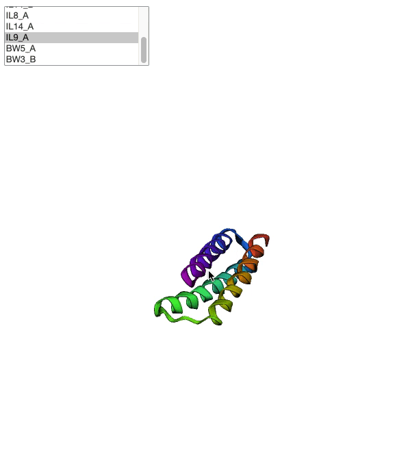

# PPIGraphX: Toward automated network construction of protein circuits

Our goal is to automate the process of protein logic gate composition from networks of interacting protein components to produce PPI networks with circuit-level function. 

